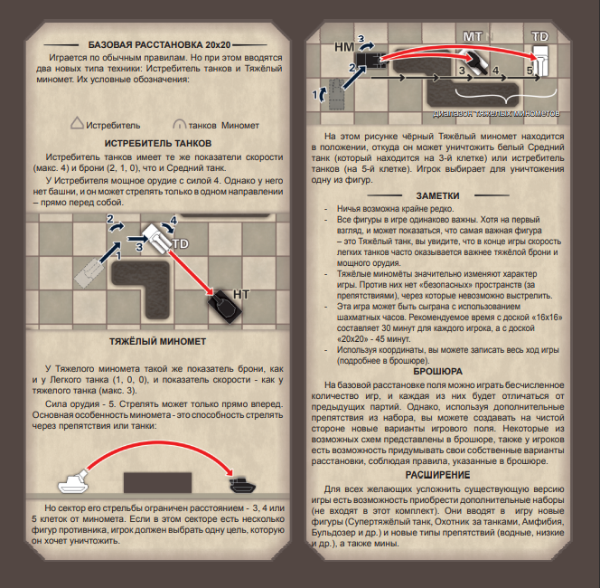

# Краткая характеристика
* Наименование программы: **Танковые шахматы** - пошаговая стратегическая игра(PC адоптация).
* Назначение программы: игровая программа для **развлечения**.
* Конечные пользователи: любители **пошаговых стратегиЙ**, **шахмат** на платформе PC.

# Техническое задание
Разработать игровое приложение(создать порт настольной игры [**Tank Chess**](https://www.boardgamegeek.com/boardgame/210113/tank-chess) для PC) на языке Python с использованием возможностей библиотеки [**PyQt5**](https://pypi.org/project/PyQt5). Игра должна разнообразить шахматы новыми возможностями, оформлением и расширить просторы поля 8 на 8. Правила игры:

# Сборка и запуск
Разработка и тестирование программы осуществлено в операционной системе **Windows 10 pro**.

## Файловая структура проекта
В разработке

Для успешного запуска и нормальной работы в операционной системе должны быть установлены следующее **компоненты**:

+ язык **Python 3.9**
+ библиотека **PyQt5 5.15.4**

# Функциональные возможности
В игре участвует 2 игрока. Каждый из которых управляет отрядом танков. Конечная цель — поставить **мат** **командному танку** противника или вывести свой **командный танк** за противоположную сторону(**совершить побег**).

## Игрок
Может посмотреть:

+ оригинальные правила;
+ параметры танков.

Выбирает танк и использует его **очки действия** на своё усмотрение:

+ поворот;
+ движение;
+ отступление;
+ выстрел.

## Танки
В распоряжении игрока находятся 6 видов танков:

Лёгкие танки|Средние танки|Тяжёлые танки|Уничтожители танков|Тяжёлые мортиры|Командирский танк

### Лёгкие танки(LIGHT TANK)
Танк имеет 5 **очков действий**(max speed), **броню**(Armour): 1 единицу передней(Front), 0 единиц боковой(Side) и 0 единиц задней(Rear), **силу выстрела**(gun) 1, **поворот**(Shooting direction) башни 90 градусов, **дальность**(Range) выстрела 2+ клетки.

### Средние танки(MEDIUM TANK)
Танк имеет 4 **очка действия**(max speed), **броню**(Armour): 2 единицы передней(Front), 1 единицу боковой(Side) и 0 единиц задней(Rear), **силу выстрела**(gun) 2, **поворот**(Shooting direction) башни 90 градусов, **дальность**(Range) выстрела 2+ клетки.

### Тяжёлые танки(HEAVE TANK)
Танк имеет 3 **очка действия**(max speed), **броню**(Armour): 3 единицы передней(Front), 2 единицы боковой(Side) и 1 единицу задней(Rear), **силу выстрела**(gun) 3, **поворот**(Shooting direction) башни 90 градусов, **дальность**(Range) выстрела 2+ клетки.

### Уничтожители танков(TANK DESTROYER)
Уничтожитель имеет 4 **очка действий**(max speed), **броню**(Armour): 2 единицы передней(Front), 1 единицу боковой(Side) и 0 единиц задней(Rear), **силу выстрела**(gun) 4, **поворот**(Shooting direction) башни 0 градусов, **дальность**(Range) выстрела 2+ клетки.

### Тяжёлые мортиры(HEAVE MORTAR)
Мортира имеет 3 **очка действий**(max speed), **броню**(Armour): 1 единицу передней(Front), 0 единиц боковой(Side) и 0 единиц задней(Rear), **силу выстрела**(gun) 5, **поворот**(Shooting direction) башни 0 градусов, **дальность**(Range) выстрела 3-5 клеток и может стрелять через преграды.

### Командный танк(COMMAND TANK)
Характеристики те же, что и у **лёгкого танка**.
Танк имеет 5 **очков действий**(max speed), **броню**(Armour): 1 единицу передней(Front), 0 единиц боковой(Side) и 0 единиц задней(Rear), **силу выстрела**(gun) 1, **поворот**(Shooting direction) башни 90 градусов, **дальность**(Range) выстрела 2+ клетки.

## Действия танков
Для управления танками используйте **английскую раскладку клавиатуры**.
Танк может использовать от 1 до максимума своих **очков действий**:

Поворот|Движение|Отступление|Выстрел|Конец хода

### Поворот
Танк может развернуться на 45 градусов вправо - **D** или влево - **A**, тратя 1 **очко действия** за каждый поворот.

### Движение
Танк продвигается прямо на 1 **клетку** - **W**, тратя 1 **очко действия** за каждое движение. Двигаться через танки нельзя. 

### Отступление
Танк может поехать назад - **S**, потратив свой максимум **очков действий**.

### Выстрел
Танк может выстрелить после того как потратил хотя бы 1 **очко действия**. При выстреле игрок выбирает поворот башни и танк противника на линии огня(союзные танки её перекрывают) и нужном расстоянии(если есть) уничтожается и становится **препятствием**, если его броня в месте попадания меньше силы выстрела. Стрелять через союзные танки и препятствия нельзя(за некоторыми исключениями).
Чтобы выстрелить, нужно нажать на видимый танк противника, которые подсвечиваются красным цветом.

### Конец хода
После нажатия кнопки **End turn**, **ход** передаётся другому игроку.

## Препятствия
Особые **клетки** поля, по которым нельзя перемещаться и стрелять(большинству танков).

# Игровой интерфейс

## Правила
При нажатии кнопки **Rules**, открывается окно с оригинальными правилами и параметрами танков.

## Игровое поле
16 * 16 клеток
На **игровом поле** находятся по 10 чёрных и белых **танков** разных классов, которые расположены абсолютно симметрично.

